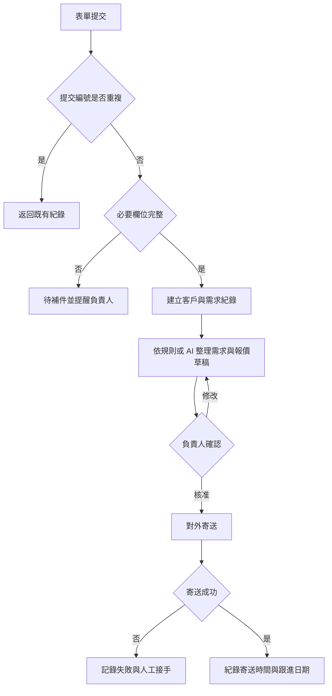
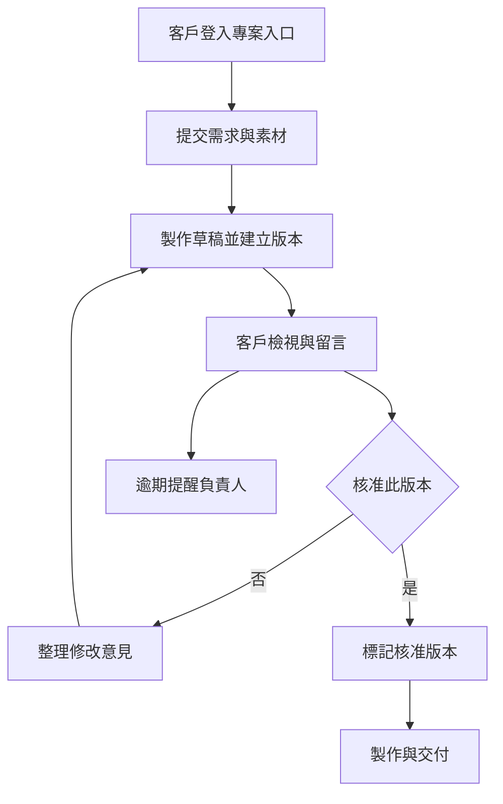
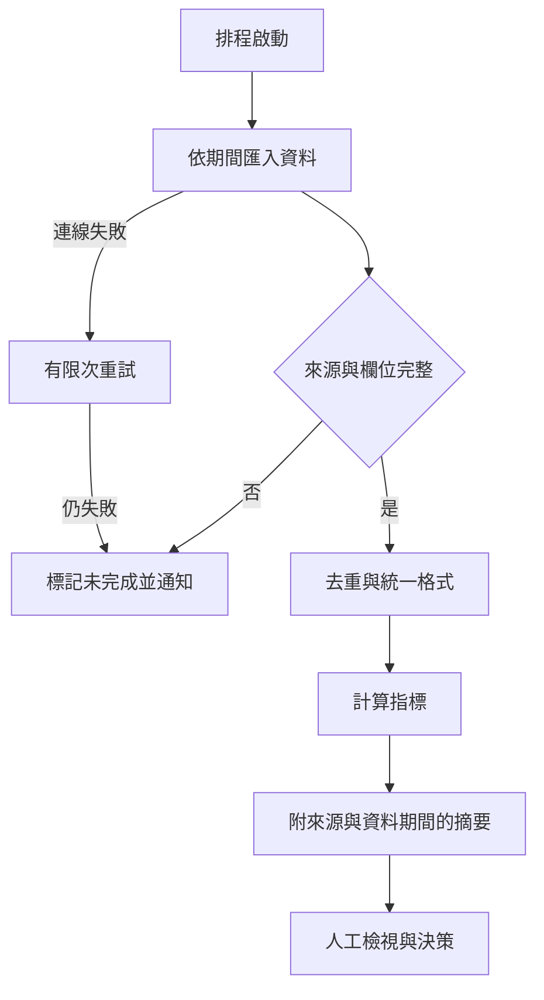

# YAMANAWA 流程建置藍圖

版本：2026-09-30。以下是可用於需求討論、估價與開發的流程規格，尚未串接客戶帳號或部署成執行中的自動化。網站提供三種流程的互動示意。

## 共通交付流程

每個階段需有負責人與完成條件。診斷輸出現況、痛點、頻率與基準；報價列交付範圍、修改與驗收；原型讓使用者走完整路徑；交接包含帳號持有者、資料位置、權限、操作文件、錯誤處理與停止方式。

## 01 詢問與報價

目的：減少收件後的人工整理，讓每筆詢問都有可追蹤狀態。

- 輸入：提交 ID、姓名／公司、聯絡方式、需求、使用量、預算與時程。
- 紀錄：狀態、負責人、來源、建立與更新時間、草稿版本、核准人、寄送事件 ID。
- 控制：不讓 AI 自訂成交價或承諾交期；核准後的確切版本才可寄出。重送依事件 ID 去重，不對外重複寄信。
- 驗收：正常收件、缺欄位、重複送出、拒絕草稿、寄送失敗、取消詢問與人工接手皆有明確結果。
- 指標：首次回覆時間、未處理詢問數、每筆人工分鐘數。先記錄基準，再設定改善目標。

## 02 品牌內容與審稿 App

目的：讓版本、意見與核准狀態集中，減少錯用檔案與來回確認。

- 使用角色：管理者、製作人員、指定客戶；客戶只可讀寫自己的專案與回饋。
- 核心介面：專案清單、版本檢視、回饋紀錄、狀態與核准按鈕、交付下載。
- 狀態：待素材 → 製作中 → 待審核 → 待修改／已核准 → 已交付。新版本建立後不得沿用舊版核准。
- 資料：project、member、asset、version、comment、approval、delivery、activity log。
- MVP：先做一個專案類型與少量使用者；付款、完整資產庫與多組織帳務不列入第一版。
- 驗收：跨客戶存取被拒絕、過期連結無法下載、未核准版本無法交付、核准後版本不可覆寫、通知失敗不改變核准狀態。
- 指標：審稿週期、返工時間、版本誤用、每週活躍使用人數。

## 03 營運資料與週報

目的：定期取得可追溯的資料，讓缺漏與異常比報表先被看見。

- 輸入：已核可來源、時間範圍、時區、欄位定義與指標公式。
- 控制：AI 只可解讀已計算數值，不能補造缺失資料；每份報告附來源與更新時間。
- 驗收：同期間重跑不重複計數、部分來源中斷顯示未完成、時區交界正確、空資料與零值有區別、帳號權限撤回能被發現。
- 指標：人工製表時間、資料完整率、成功執行率、失敗修復時間、每月平台與 API 成本。

## 工具選擇與交接

依客戶既有帳號、可用 API、資料位置、維護能力與費用評估工具，不預先綁定某一家供應商。簡單規則使用確定性處理；需要摘要或分類才考慮 AI。使用正式資料前先用樣本驗證，交接時提供設定備份、資料匯出、環境變數名稱（不把密鑰放進版本庫）、操作文件與停止／復原步驟。
